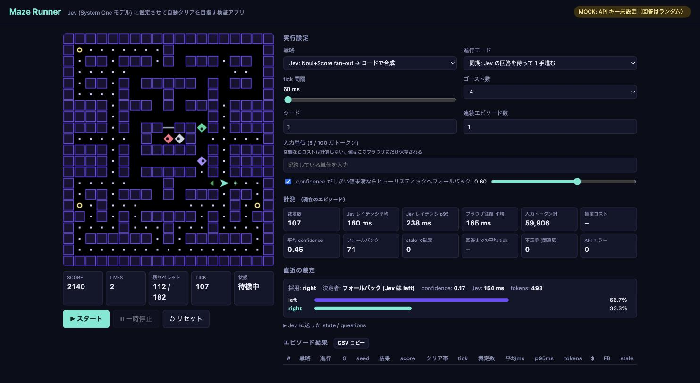

# Maze Runner

迷路でペレットを集めながらゴーストから逃げる、古典的な迷路チェイス系のブラウザゲーム。
プレイヤー（ランナー）の進行方向を TypeSafe AI の System One モデル **Jev** に裁定させ、自動クリアを目指す。



*MOCK モード（API キーなし・回答はランダム）での画面。表示されているレイテンシや confidence はダミー値で、Jev の実測値ではない。*

「制御フローとルールはコード、意味的な判断だけ Jev」という公式の設計方針（Harness Engineering / Real-time applications）を、
レイテンシ・トークン量・confidence を計測しながら確かめるための検証アプリ。

## 起動

Node.js 22.9 以上。依存パッケージはない。

```sh
# リポジトリのルートで（初回のみ）
cp .env.example .env   # TYPESAFE_API_KEY を記入

cd apps/maze-runner
npm start              # http://localhost:8787
```

API キーが無い場合は **MOCK モード**（回答はランダム）で起動し、画面の動作だけ確認できる。
API キーはサーバ (`server.mjs`) だけが持ち、ブラウザには渡らない。

## 戦略

| 戦略 | 内容 | 検証の狙い |
|---|---|---|
| Jev: Choice × 特徴量ラベル | BFS で求めた距離を `deadly / high / near …` のラベルにして渡し、Choice 1 問で方向を選ばせる | 公式推奨の使い方。数値はコード、判断は Jev |
| Jev: Noul+Score fan-out | 方向ごとに「危険か (Noul)」「旨味 (Score)」を 1 リクエストで並列に聞き、コードで `value − 1.5 × danger` に合成 | Speculative fan-out / Composite scoring パターン |
| Jev: Choice × ASCII 盤面 | 盤面をそのままテキストで渡す | 空間把握を丸投げした場合の限界確認 |
| Jev: 戦術ラベル × Score fan-out | 下記の戦術ラベルを渡し、方向ごとに「危険度 (Score 5 段階)」「得点の見込み (Score 10 段階)」「パワーペレットの無駄遣いか (Noul)」を並列に聞く。段階ごとの重みで合成するのはコード | ハイスコア狙い。判断は Jev、方針（重み）はコード |
| Jev: 戦術ラベル × Choice | 同じ戦術ラベルを渡し、優先順位つきの Choice 1 問で選ばせる | トレードオフまで Jev に任せた場合との比較 |
| ヒューリスティック / 戦術ヒューリスティック / ランダム | API を使わないベースライン。戦術版は Jev と同じ戦術特徴量を数値のまま使う | 比較対象、および Jev 戦略のフォールバック先 |

### 戦術ラベル

最寄り距離だけでは分からない文脈を、コードが BFS で求めてラベルにする。

| ラベル | 内容 |
|---|---|
| `ghost_approaching` | その方向の最寄りゴーストがこちらへ向かっているか（ゴーストは反転できないので、離れていくなら脅威は小さい） |
| `cut_off_risk` | 次の分岐点に、ゴーストが自分より先に着けるか（一本道での挟み撃ち） |
| `pellets_this_way` | その方向のペレット密度 (`none / few / some / many`) |
| `edible_ghost` | 怯え時間内に追いつける食べられるゴーストまでの近さ（間に合うかの計算はコード側） |
| `ghost_mode` / `edible_time_left` / `dangerous_ghosts_nearby` / `pellets_left` | 盤面全体の状況。ゴーストを引きつけてからパワーペレットを取ると連続で食べられ、得点が大きく伸びる |

どの戦略でも選択肢には**合法手しか入れない**ため、壁に向かう手は型として返ってこない（「不正手」カウンタで確認できる）。

## 進行モード

- **同期**: 1 手ごとに Jev の回答を待つ。判断の質だけを見たいとき用。ゲーム速度はレイテンシで決まる。
- **リアルタイム**: tick は固定間隔で進み、回答が届くまでランナーは直進する。届いた手がその時点で打てなければ `stale` として破棄。
  tick 間隔を縮めていくと、レイテンシが成績に効き始める境界が見える。

`confidence` がしきい値未満の裁定をヒューリスティックに差し替える Confidence-gated routing も切り替えられる。
fan-out 戦略は Jev の confidence を持たないため、合成スコアの 1 位と 2 位の差で代用している。

## リプレイと裁定インスペクタ

ゲームはシード付きで決定的なので、エピソードごとに「シード + 各 tick の手 + 各裁定」を記録しており、終わったあとで 1 手ずつ見直せる。
一時停止中の「⏪ リプレイ」か、エピソード結果の各行の「▶ リプレイ」から開く。

- シークバー / コマ送り（←/→、Shift で 10 手）/ 再生（Space）/ 速度変更
- ジャンプ: ミスした手、ヒューリスティックと不一致の手、フォールバックした手、confidence 0.5 未満、レイテンシ 500ms 超、API エラー / stale
- 盤面は「その手を打つ直前」を表示し、Jev の確率を矢印で、実際に採用した手を白枠で重ねる
- 裁定インスペクタには、その手について次を表示する
  - Jev に渡したラベル（方向ごとの表）と盤面全体の状況
  - Jev の回答（段階スコアと confidence。セルにカーソルを置くとその段階の説明文）と、コードがそれをどう点数に換算して合成したか
  - 採用した手、ヒューリスティックならどの手だったか、レイテンシ、ブラウザ往復、トークン数、リトライ回数、質問時と反映時の tick
  - リクエスト / レスポンスの全文
- 「JSON 保存」で書き出し、「リプレイ読込」で読み込める。ファイルにはレイテンシなどの実測値が含まれるので、公開しないこと

## 計測

エピソードごとに 結果 / クリア率 / 裁定数 / レイテンシ (平均・p95) / 入力トークン / フォールバック数 / stale 数 を記録し、CSV でコピーできる。
画面の「入力単価」に自分の契約単価を入れると推定コストも表示する（値はブラウザにだけ保存され、リポジトリには含まれない）。
乱数はシード付きなので、同じシード・ゴースト数なら戦略間で同じ条件の比較になる（リアルタイム進行は回答タイミングに依存するため厳密には再現しない）。

> **計測結果の扱い**: TypeSafe AI の利用規約は、サービスのベンチマークや性能情報の公開を禁じている。
> このアプリで得た数値は手元の検証にとどめ、公開する場合は事前に TypeSafe AI の許可を得ること。

## 構成

```
server.mjs         静的配信 + /api/decide (Jev へのプロキシ、429/529 はリトライ)
public/game.js     ゲームエンジン（DOM 非依存、シード付き乱数）
public/agent.js    盤面 → state/questions 変換、回答の解釈、ヒューリスティック
public/main.js     描画、実行ループ、計測、リプレイ
scripts/sim.mjs    ベースラインをヘッドレスで回す:   npm run sim -- 30 4
scripts/bench.mjs  Jev 戦略をヘッドレスで回す (要サーバ起動): npm run bench -- 3 4
```

プロンプト（instructions / criteria / ラベルの閾値）を調整する場所は `public/agent.js`。
