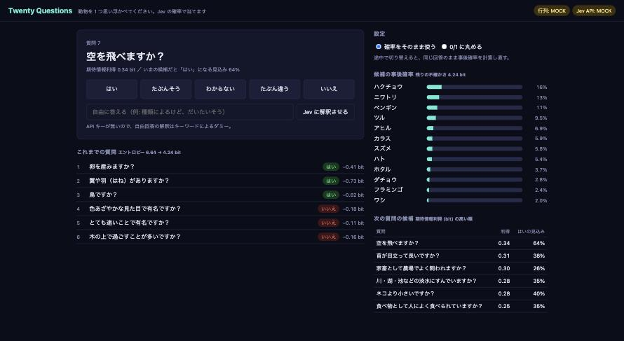

# Twenty Questions

プレイヤーが思い浮かべた動物を、質問を重ねて当てる「20 の質問」形式のブラウザゲーム。
知識は TypeSafe AI の System One モデル **Jev** が出した確率だけで、推論（質問選びと絞り込み）はコードが行う。



*MOCK モード（人手の正解表にノイズを乗せた行列）での画面。表示されている確率は Jev の出力ではない。*

Jev は文章を生成せず、確率つきの判断を返す。このアプリはその確率を**そのまま尤度として使う**ので、
確率の質（キャリブレーション）が「何問で当たるか」に直結する。確率を 0/1 に丸めた場合と比べて、確率を返すことの価値を確かめる。

## しくみ

1. **事前計算**: 候補 100 種 × 質問 44 個について「この動物は〜ですか？」を Noul で聞き、確率行列を作る。
   候補 1 件につき 1 リクエスト（state は動物名だけ、質問 44 個を fan-out）なので 100 リクエストで済む。
2. **質問選び（コード）**: 現在の事後確率のもとで、期待情報利得 (bit) が最大の質問を出す。
3. **絞り込み（コード）**: 回答を「はい度」`v` (1 = はい … 0 = いいえ) に直し、候補ごとの尤度 `v·p + (1−v)·(1−p)` でベイズ更新する。
   「わからない」(`v = 0.5`) は全候補で尤度が同じになり、何も更新しない。プレイヤーの勘違いや行列の誤りを見込んで、尤度には一定のノイズを混ぜる。
4. **回答**: 事後確率が閾値を超えるか、有効な質問が尽きたら答えを言う。外れたらその候補を消して続行し、3 回外すと降参。
5. **自由回答（Jev）**: ボタンの代わりに文章で答えると、Jev が Score で「はい度」に変換する（例:「種類によるけど、だいたいそう」）。
6. **未知の動物を覚えさせる（Jev）**: 候補に無い動物の名前を入れると、その場で 44 問を 1 リクエストで聞いて行列に行を足す。

ゲーム中に Jev を呼ぶのは 5 と 6 だけで、通常の質問と絞り込みは事前計算した行列だけで動く。

## 起動

Node.js 22.9 以上。依存パッケージはない。

```sh
# リポジトリのルートで（初回のみ）
cp .env.example .env   # TYPESAFE_API_KEY を記入

cd apps/twenty-questions
npm run build-matrix   # Jev に確率行列を作らせる（data/matrix.json、初回のみ）
npm start              # http://localhost:8788
```

`data/matrix.json` が無い場合は **MOCK 行列**（人手の正解表にノイズを乗せたもの）で動き、API キーが無い場合は自由回答の解釈と学習もダミーになる。
API キーはサーバ (`server.mjs`) だけが持ち、ブラウザには渡らない。

`build-matrix` は埋まっていないセルがある候補だけを聞き直すので、`public/data.js` に質問や候補を足したあとにも使える。
全部作り直すときは `npm run build-matrix -- --force`、一部だけなら `--only=lion,tiger`。

## 画面

- **候補の事後確率**: 上位 12 件のバー。回答のたびに動く。
- **次の質問の候補**: 期待情報利得の高い順と、いまの候補分布で「はい」になる見込み。
- **これまでの質問**: 回答と、その回答で実際に減ったエントロピー。自由回答なら Jev の解釈結果（はい度と confidence）も出る。
- **確率をそのまま使う / 0/1 に丸める**: ゲームの途中でも切り替えられ、同じ回答のまま事後確率を計算し直す。
- **答え合わせ**: ゲーム終了後、思い浮かべた動物について「あなたの回答」と「Jev の p(はい)」を並べ、大きく食い違った質問を強調する。
  当てられなかった原因が Jev の知識なのか、質問文の曖昧さなのか、自分の回答なのかを切り分けるためのもの。

## 検証用スクリプト

`public/data.js` には、質問ごとに「当てはまる候補 (yes)」と「種類や見方による候補 (maybe)」を人手で付けた正解表がある。
実プレイの推論には使わず、次の 2 つの評価と MOCK 行列にだけ使う。正解表は作者の判断なので、Jev との食い違いがすべて Jev の誤りとは限らない。

```sh
npm run sim                       # 正解表どおりに答えるプレイヤーで全候補を当てさせる
npm run sim -- --flip=0.05        # プレイヤーが 5% の確率で yes/no を言い間違える場合
npm run calibration               # Jev の確率行列を正解表と突き合わせる
```

- `sim` は行列の作り方を 3 通り比べる: **soft**（Jev の確率そのまま）/ **hard**（0/1 に丸める）/ **truth**（正解表そのもの。この質問セットでの上限の目安）。
  正解率、1 回目の回答で当たった率、平均質問数を出す。
- `calibration` は信頼性ビン（Jev が p と言ったセルのうち実際に yes だった割合）、Brier スコア、ECE、質問ごとの成績、大きく外したセルの一覧を出す。
  外したセルの一覧は、質問文の直しどころ（Jev は質問を文字どおりに読む）を探すのに使う。

> **計測結果の扱い**: TypeSafe AI の利用規約は、サービスのベンチマークや性能情報の公開を禁じている。
> このアプリで得た数値や `data/matrix.json`（Jev の出力そのもの。`.gitignore` 済み）は手元の検証にとどめ、公開する場合は事前に TypeSafe AI の許可を得ること。

## 構成

```
server.mjs                静的配信 + /api/state, /api/interpret, /api/learn
lib.mjs                   Jev 呼び出し、Jev への質問の組み立て、行列の読み書き、MOCK 行列
public/data.js            候補 100 種・質問 44 個・人手の正解表
public/engine.js          ベイズ更新と質問選び（DOM 非依存）、シミュレーション用プレイヤー
public/main.js            画面の進行と描画
scripts/build-matrix.mjs  確率行列の生成
scripts/sim.mjs           soft / hard / truth の比較
scripts/calibration.mjs   キャリブレーション評価
```

Jev への問い方（instructions / criteria）を調整する場所は `lib.mjs`、質問文そのものは `public/data.js` の `en`。
Jev は英語が主言語なので Jev には `en` を渡し、画面には `ja` を出している。

候補・質問・正解表はすべてこのリポジトリのために書き起こしたもので、既存のゲームやサービスのデータは使っていない。
